# AI Use Statement

Generative AI was used as a support tool during the completion of this assignment. Its use was limited to clarifying R functions, helping diagnose Quarto rendering issues, and improving understanding of how to interpret statistical visualisations. AI was not used to generate the final analysis, results, or conclusions presented in the report. All code, data cleaning decisions, visualisations, and written interpretations submitted in the main report were completed and reviewed by me.

The specific prompts used were:

1. Can you explain how parse_date_time works in R and why some dates fail to parse?
2. How can I handle missing values when calculating mean in R using summarise?
3. Can you explain what geom_smooth(method = "lm") does in ggplot2?
4. What does a positive relationship between two variables in a scatter plot mean?
5. How should I interpret correlation between two variables in a dataset?
6. Why is my Quarto document not rendering and how do I fix common rendering errors?

These interactions were used only to support debugging, understanding of R functions, and interpretation of results. They were not copied directly into the report without review and adaptation.

# Screenshots of AI Interactions

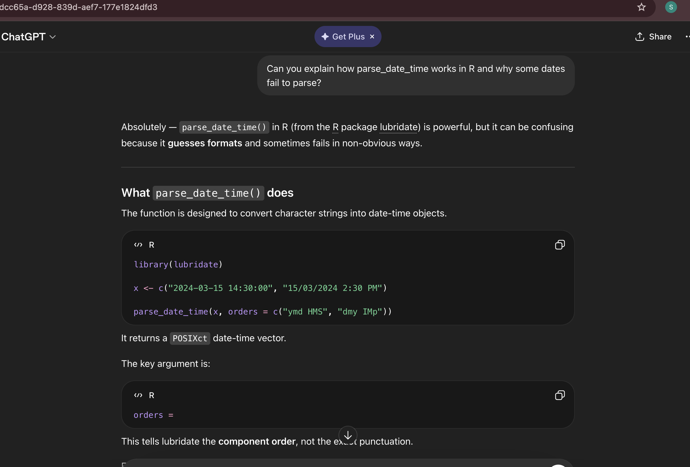

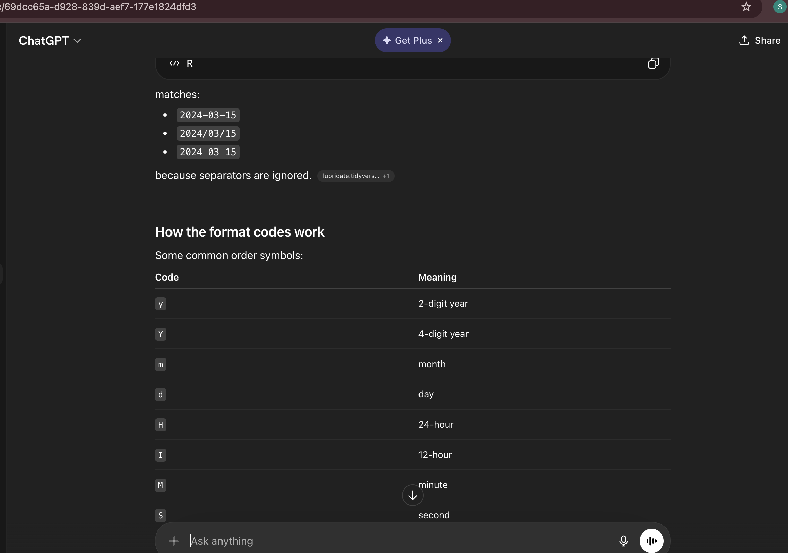

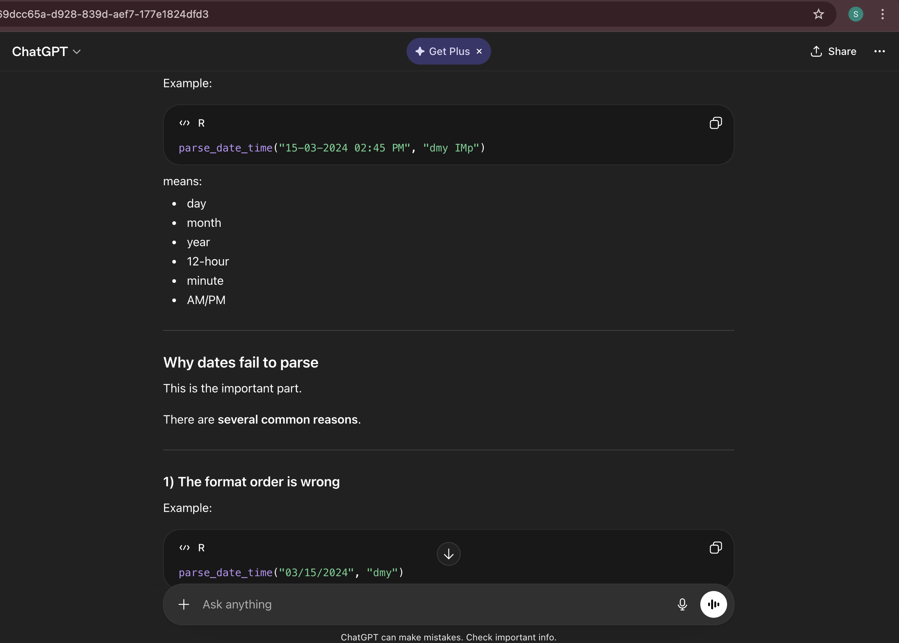

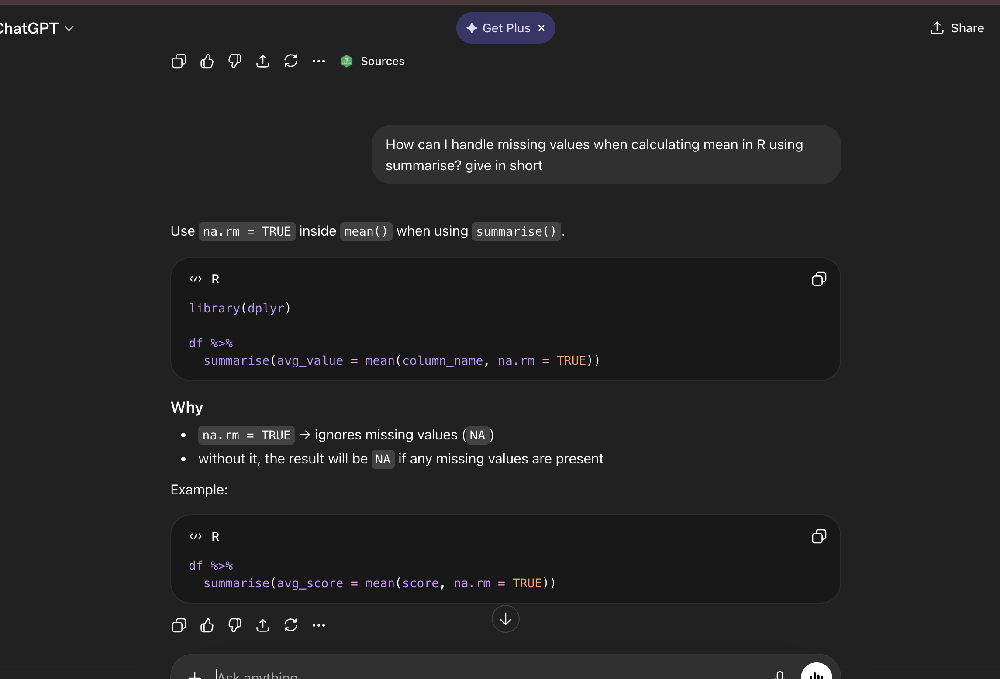

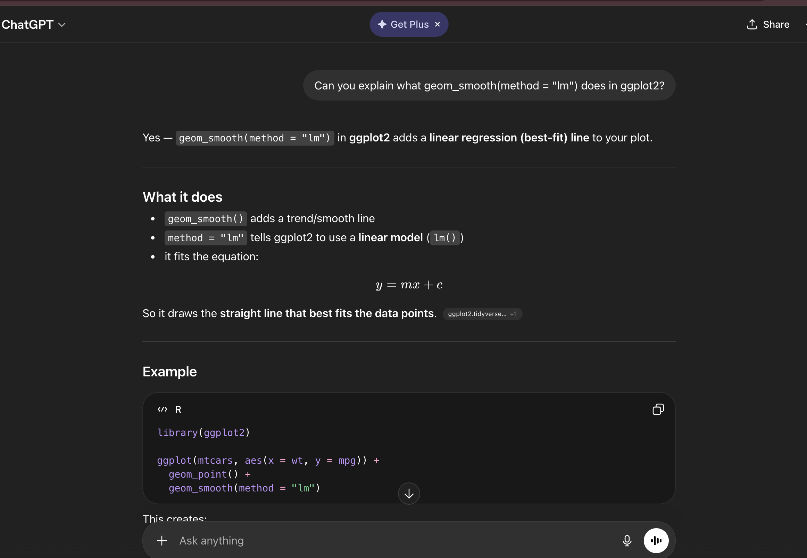

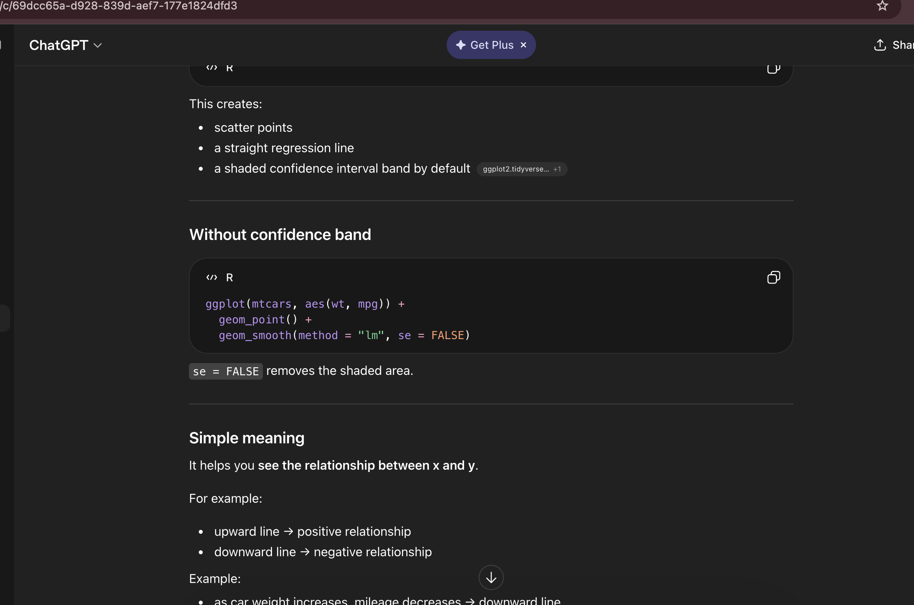

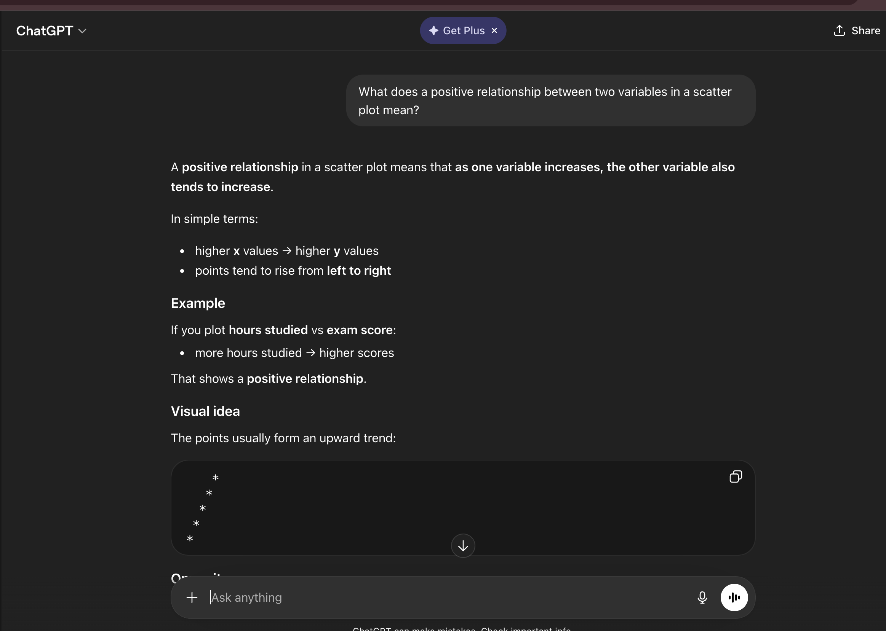

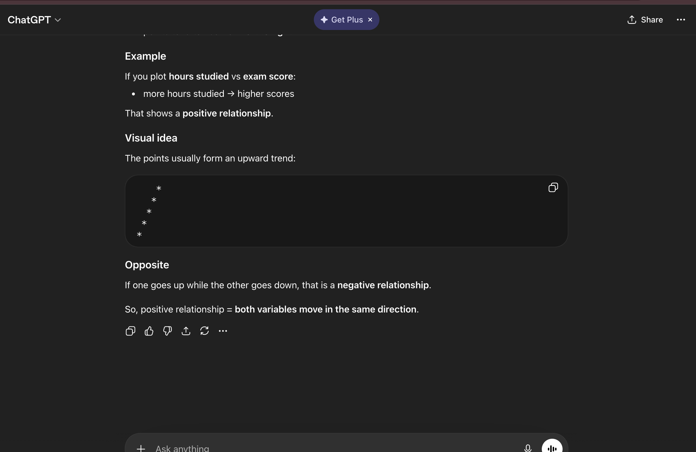

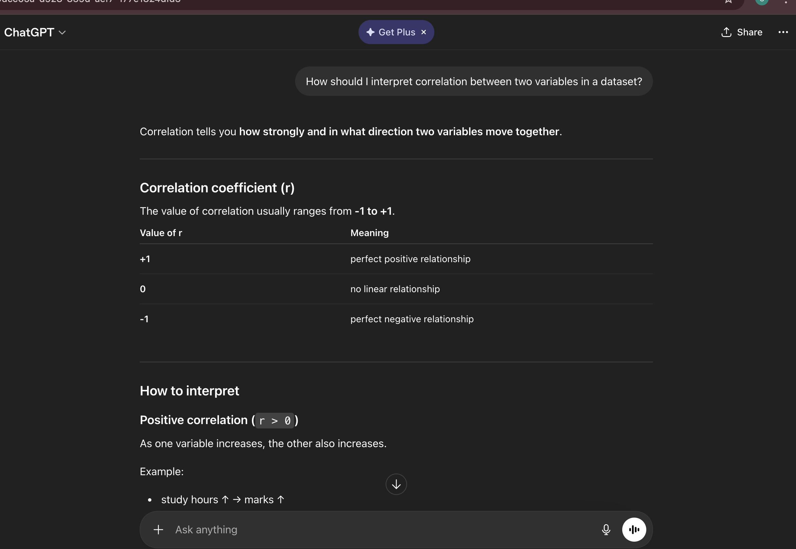

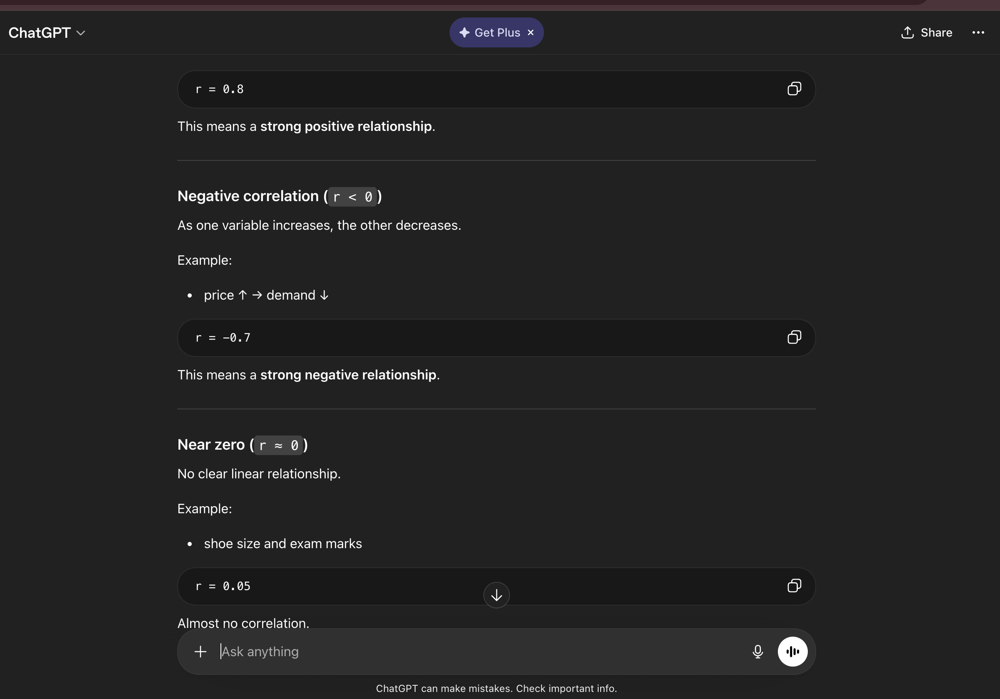

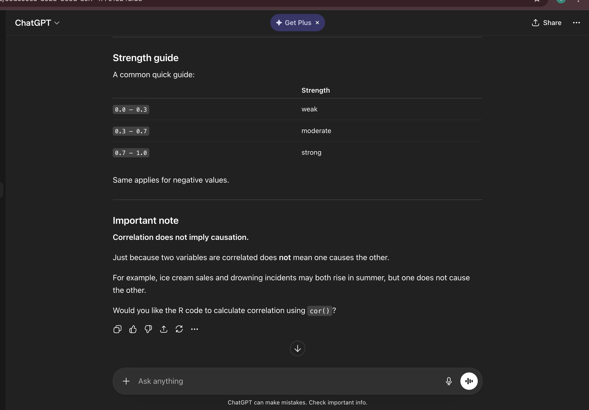

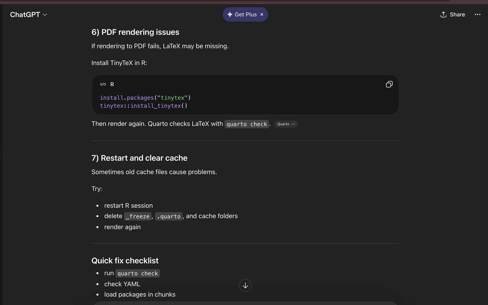

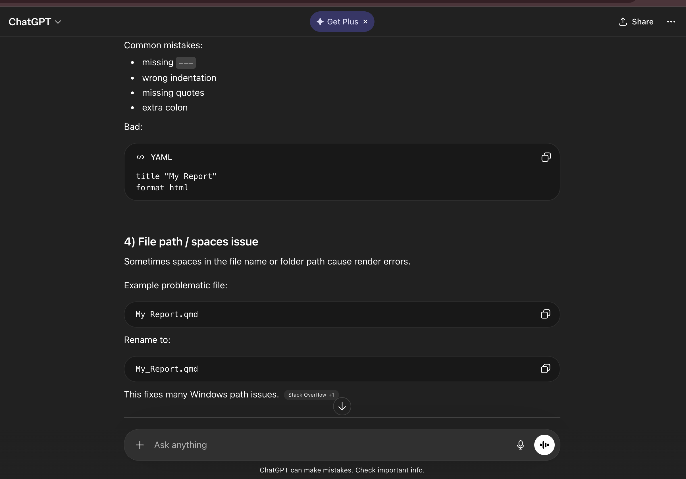

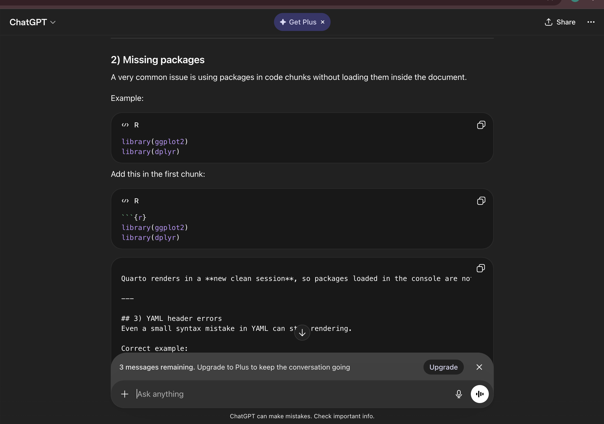

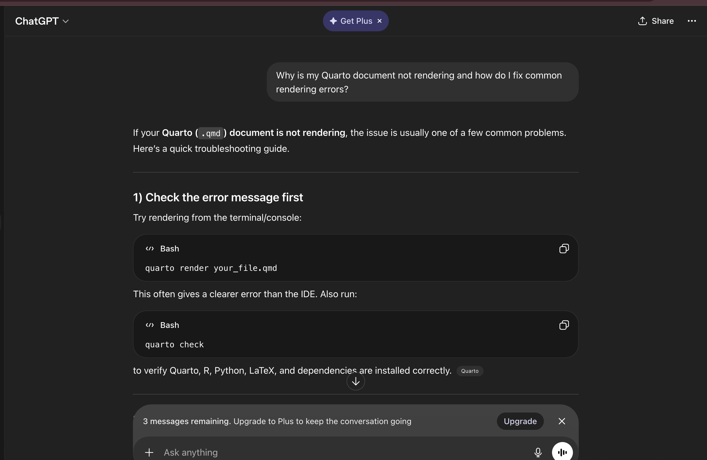

# link - 

https://chatgpt.com/share/69dcd3e0-9274-8323-b74b-e6f628bdca02
